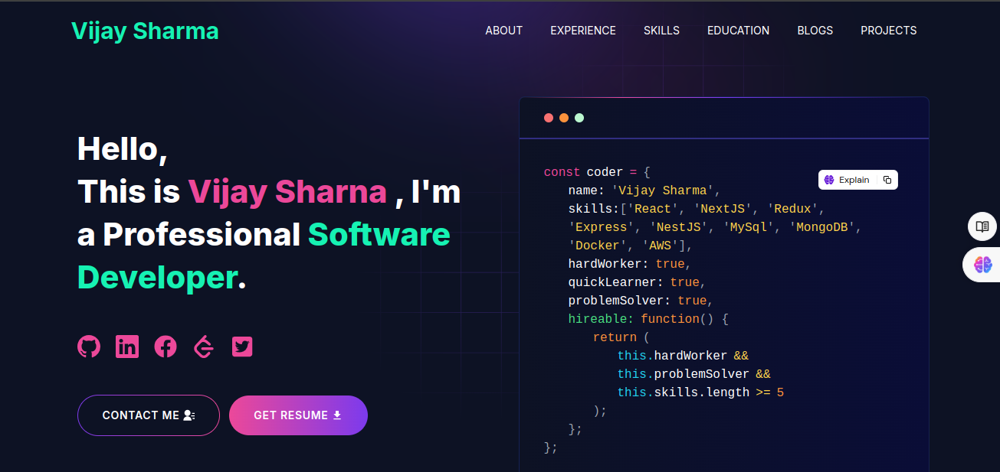

# Developer Portfolio 🚀

[](https://portfolio-theta-three-49.vercel.app/)
[](https://github.com/vijaythaska1/portfolio.git)

A modern, fully customizable developer portfolio template built with Next.js and Tailwind CSS. Perfect for developers and freelancers looking to showcase their skills and projects professionally.


## ✨ Features

- 📱 Fully Responsive Design
- 🎨 Modern UI/UX
- 📧 Integrated Contact Form with EmailJS
- 📝 Dynamic Blog Section (Dev.to Integration)
- 🌙 Clean and Professional Layout
- ⚡ Fast Performance
- 🔍 SEO Friendly

## 🎯 Sections

- **Hero Section** - Make a strong first impression
- **About Me** - Share your professional journey
- **Experience** - Showcase your work history
- **Skills** - Highlight your technical expertise
- **Projects** - Display your portfolio work
- **Education** - List your academic achievements
- **Blog** - Share your thoughts and knowledge
- **Contact** - Let visitors reach out to you

## 🚀 Quick Start

### Prerequisites

Before you begin, ensure you have the following installed:
- [Node.js](https://nodejs.org/) (v14 or higher)
- [Git](https://git-scm.com/)

### Installation

1. **Clone the repository**
```bash
git clone https://github.com/<YOUR-USERNAME>/developer-portfolio.git
cd developer-portfolio
```

2. **Install dependencies**
```bash
npm install
# or
yarn install
```

3. **Set up environment variables**
   - Copy `.env.example` to `.env`
   - Fill in the required credentials:
```env
NEXT_PUBLIC_EMAILJS_SERVICE_ID=your_service_id
NEXT_PUBLIC_EMAILJS_TEMPLATE_ID=your_template_id
NEXT_PUBLIC_EMAILJS_PUBLIC_KEY=your_public_key
NEXT_PUBLIC_GTM=your_gtm_id
NEXT_PUBLIC_APP_URL=http://localhost:3000
NEXT_PUBLIC_RECAPTCHA_SITE_KEY=your_site_key
NEXT_PUBLIC_RECAPTCHA_SECRET_KEY=your_secret_key
```

4. **Start the development server**
```bash
npm run dev
# or
yarn dev
```

5. **Open [http://localhost:3000](http://localhost:3000) in your browser**

## 🛠️ Customization

### Personal Information
Edit `utils/data/personalData.js`:
```javascript
export const personalData = {
name: "Vijay Sharna",
  profile: '/profile.jpeg',
  designation: "Software Developer",
  description: "My name is Vijay Sharma. I am a professional and enthusiastic programmer in my daily life. I am a quick learner with a self-learning attitude. I love to learn and explore new technologies and am passionate about problem-solving. I love almost all the stacks of web application development and love to make the web more open to the world. My core skill is based on JavaScript and I love to do most of the things using JavaScript. I am available for any kind of job opportunity that suits my skills and interests.",
  email: 'Vijaythaska2@gmail.com',
  phone: '+91-7300760917',
  address: '1031, Phase 3B2, Phase 3B-2, Sector 60, Sahibzada Ajit Singh Nagar, Punjab 160059',
  github: 'https://github.com/vijaythaska1',
  facebook: 'https://www.facebook.com/share/ReSyAzBG9iGEJ2S1/',
  linkedIn: 'https://www.linkedin.com/in/vijay-sharma1',
  twitter: 'https://twitter.com/VIJAYSH96442927',
  stackOverflow: 'https://stackoverflow.com/users/27639378/vijay-sharma',
  leetcode: "https://leetcode.com/u/vijayshrama/",
};
```

### Content Sections
Customize content in the following files under `utils/data/`:
- `experienceData.js`
- `projectsData.js`
- `skillsData.js`
- `educationData.js`

## 📦 Technology Stack

- **Framework**: Next.js
- **Styling**: Tailwind CSS, SASS
- **Form Handling**: EmailJS
- **Animations**: Lottie React
- **Icons**: React Icons
- **Notifications**: React Toastify
- **Additional Features**: React Fast Marquee

## 📝 EmailJS Setup

1. Create an account at [EmailJS](https://www.emailjs.com/)
2. Create a new email service
3. Create an email template
4. Copy credentials to your `.env` file

## 🤝 Contributing

Contributions are welcome! Please feel free to submit a Pull Request.

1. Fork the repository
2. Create your feature branch (`git checkout -b feature/AmazingFeature`)
3. Commit your changes (`git commit -m 'Add some AmazingFeature'`)
4. Push to the branch (`git push origin feature/AmazingFeature`)
5. Open a Pull Request

## 📄 License

This project is licensed under the MIT License - see the [LICENSE](LICENSE) file for details.

## 📞 Support

If you have any questions or need help, please open an issue in the GitHub repository or reach out via email.

---

Made with ❤️ by Vijay Sharma